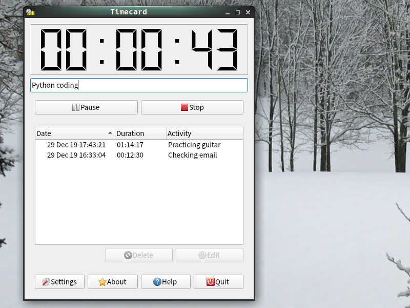
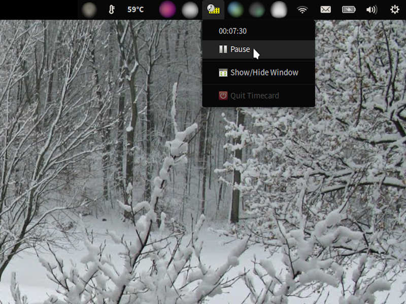
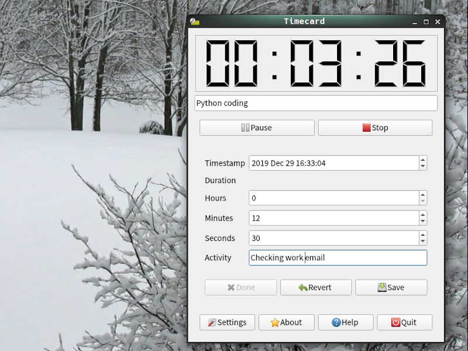
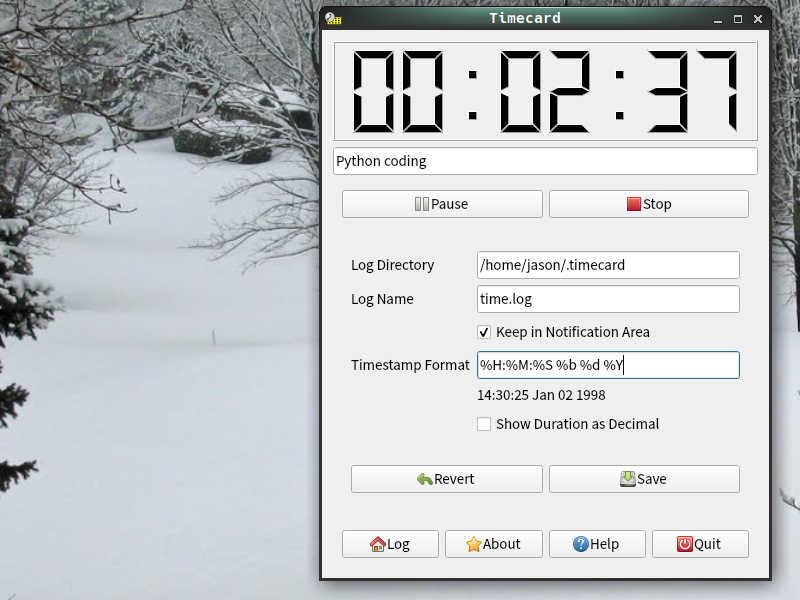

# Features

Time tracking should be simple. **Timecard** allows you to start, pause, and
log how much time you spend, all from within a simple, unified interface.
Just click `Start`, close the window, and get back to work! Timecard hangs
out in your system tray until you need it.



Timecard offers a **simple, unified interface** where you can see your time
log, manage the current timer, and more. The adaptive interface prompts you to
confirm before doing things like stopping a timer or discarding an entry.



You can see the current timer and pause or resume your time right from the
system tray. The quit option in the system tray menu is even disabled if you
have an unsaved timer, to prevent you from accidentally discarding time!



Started your timer late? Typo in your activity note? You can **edit time log
entries** right in Timecard.



You can customize where Timecard saves your logs, and quickly switch between
log files without restarting the program. You can also edit the timestamp
format displayed in the log, using the familiar 1989 C standard datetime
formatting.

You can even display your entry durations in decimal
hours, so you never have to drag out your calculator again when entering
billable hours on your company's time reporting software.

# What's Next?

We're planning to add a few additional features to Timecard in the coming year:

* Pomodoro: Focus reminders, tracking Pomodoros, and a "manual" timer wind.
* Alarms: Set reminders for yourself without having to bring another program
into the equation.
* Profiles: Associate log files with particular people or categories, and
switch between them with a click.

No matter what, we're staying focused on Timecard's prime objective:
**tracking time beautifully!**

# A Little History

Timecard 1.0 was created many moons ago by a budding software developer
named [Jason C. McDonald](https://indeliblebluepen.com), using Visual
Studio .NET 2010. The original Windows-only release was distributed by
the then newly-founded [MousePaw Games](https://mousepawmedia.com).
(Un)fortuntely, that version's source code and installer have both been
lost over the years, and all known downloads are locked away within
unauthorized adware installers (darn it, Cnet!)

After years of pining for his first successful project, Jason finally
resurrected Timecard, recreating and re-imagining it
with modern Python and Qt 5 (PySide2), and releasing it as open source
software so it can never be lost to the silicon dioxide of history again.

Long live Timecard!

# Download!

Timecard is built with PySide2 (Qt 5), so it should run on all modern operating
systems: Windows, Mac, and Linux.

Right now, the easiest way to install Timecard is through PyPI:

```bash
pip install --user timecard-app
```

Then, just run with:

```bash
timecard-app
```

We're working on creating various distribution packages, so stay tuned!

* Debian (`.deb`)
* Snapcraft
* Windows Installer

# Contribute

Timecard 2.0 is **free and open source software**, licensed under the
BSD-3-Clause license. You can access the source code, submit issue reports,
and create pull requests via [GitHub](https://github.com/codemouse92/timecard).
